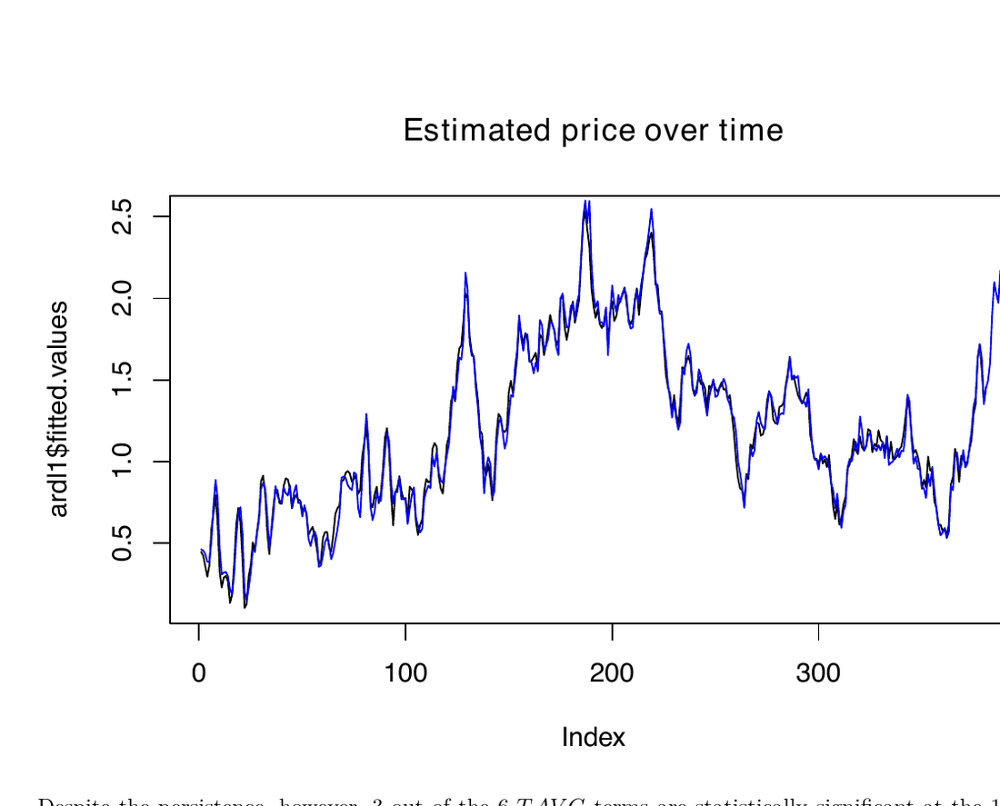

# Natural-gas futures forecasting

> Historical portfolio project from SMU ECON207 Intermediate Econometrics. The repository preserves the submitted analysis and is not actively maintained.

## Research question

This project asks whether changes in United States temperature forecasts affect Henry Hub natural-gas futures prices. The analysis uses leading realized temperatures as a proxy for unavailable historical temperature forecasts and estimates dynamically complete time-series models with trend, seasonality, storage, imports, and autoregressive terms.

The submitted analysis finds a relationship between contemporaneous temperature and futures prices but limited evidence that the proxy for forecast temperatures adds explanatory value.

## Example output

An example fitted-price output from the submitted time-series model.

## Repository contents

| Path | Purpose |
| --- | --- |
| [`BharatG_Project.Rmd`](./BharatG_Project.Rmd) | Full R Markdown analysis and narrative. |
| [`BharatG_Project.pdf`](./BharatG_Project.pdf) | Rendered submission. |
| [`DATA_SOURCES.md`](./DATA_SOURCES.md) | Missing-input inventory and reconstruction guidance. |

## Reproducibility status

The repository is a portfolio artifact and is **not reproducible from the tracked files alone**. The R Markdown expects the following untracked inputs:

- `NG2_N.XLS`
- `USC00218450.csv`
- `NG_MOVE_IMPC_S1_M.xlsx`
- `NG_STOR_SUM_A_EPG0_SAT_MMCF_M.xlsx`
- `bib.bib`

The report describes the underlying sources, including EIA natural-gas series and GSOM/NCEI temperature data. Obtain current or archived copies directly from the relevant providers and confirm their redistribution terms before attempting to rebuild the analysis.

## Historical environment

The R Markdown uses `lubridate`, `scales`, `tsibble`, `readxl`, `sandwich`, `forecast`, `tidyverse`, and `car`, as well as a LaTeX installation compatible with `xelatex`. Package versions were not recorded, so current compatibility is unverified.

## Limitations

Leading realized temperatures are an imperfect proxy for historical forecasts. The model and conclusions reflect the original sample period and should not be interpreted as current trading advice or as a validated forecasting system.

## License and reuse

No open-source license has been applied. The analysis is shared for viewing as portfolio work. Data, references, and third-party materials remain subject to their source terms.
